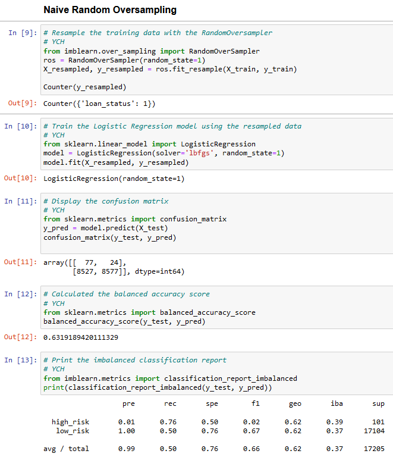
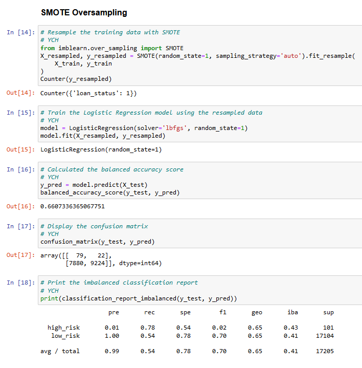
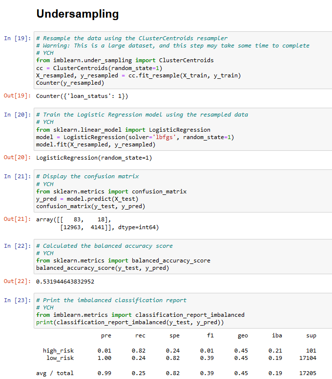
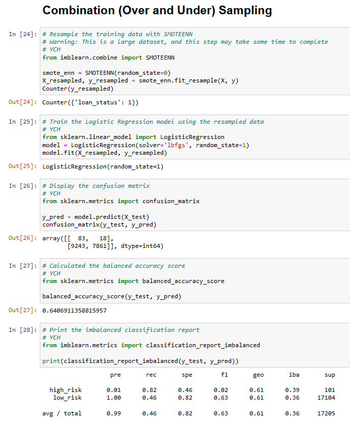
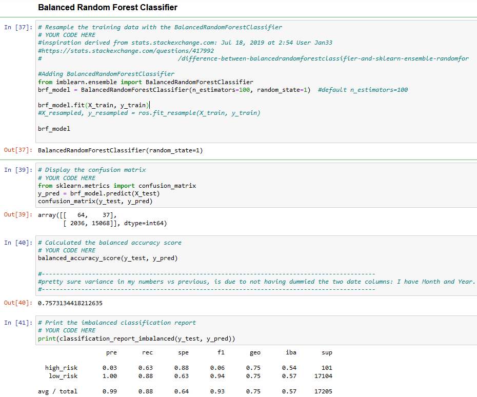
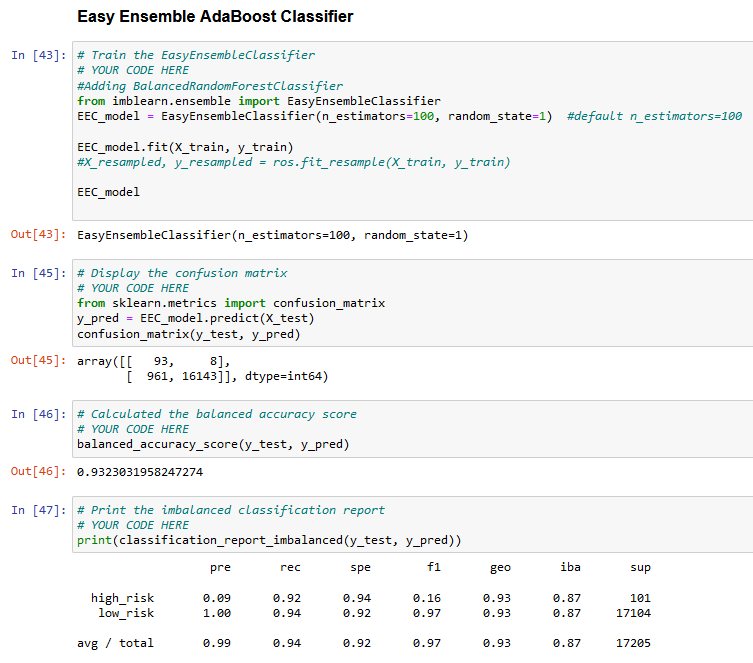

# The purpose of this analysis is to compare different machine learning models and contemplate their strengths and weaknesses.

## This project involves the use of several models, these are enumerated and displayed below.

### 1. Random Over Sampler

### 2. SMOTE Over Sampler

### 3. Cluster Centroids Under Sampler

### 4. SMOTEENN Over Under Combination Sampling

### 5. Balanced Random Forest Classifier

### 6. Easy Ensemble Classifier

(Requested Bulleted List replaced with a nicely formatted table for readability)

## To summarize the data shown above in a table
 _ | BAS | PRE HighRisk | PRE LowRisk | Recall HighRisk | Recall LowRisk | F1 High Risk | F1 Low Risk
--- | --- | --- | --- | --- | --- | --- | ---
Random Over Sampler | 0.631918942 | 0.01 | 1 | 0.76 | 0.5 | 0.02 | 0.67
SMOTE Over Sampler | 0.660733637 | 0.01 | 1 | 0.78 | 0.54 | 0.02 | 0.7
Cluster Centroids Under Sampler | 0.531944644 | 0.01 | 1 | 0.82 | 0.24 | 0.01 | 0.39
SMOTEENN Over Under Combination Sampling | 0.640691136 | 0.01 | 1 | 0.82 | 0.46 | 0.02 | 0.63
Balanced Random Forest Classifier | 0.757313442 | 0.03 | 1 | 0.63 | 0.88 | 0.06 | 0.94
**Easy Ensemble Classifier** | **0.932303196** | **0.09** | **1** | **0.92** | **0.94** | **0.16** | **0.97**

## From the data table, I observe none of the models are perfect.
They all are decent at Identifying HighRisk with the lowest being 0.76.
There is a large difference in Identifying LowRisk, the worst being 0.5 and the best being 0.92.  There is a very large amount of LowRisk being included in the HighRisk Group (below 0.1 in all 6 Models for the PRE HighRisk Column) The F1-HighRisk score for most Models is below 0.1. The models are decent at identifying Low risk and good at identifying high risk, but they appear to be putting too many LowRisk into the HighRisk group. 

### In conclusion, the Easy Ensemble Classifier performs better than the Random Over Sampler (0.09 vs 0.01(PRE-HR), and 0.16 vs 0.02(F1-HR) respectively)

